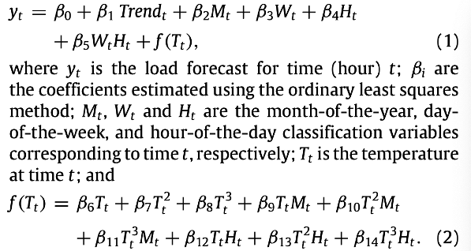
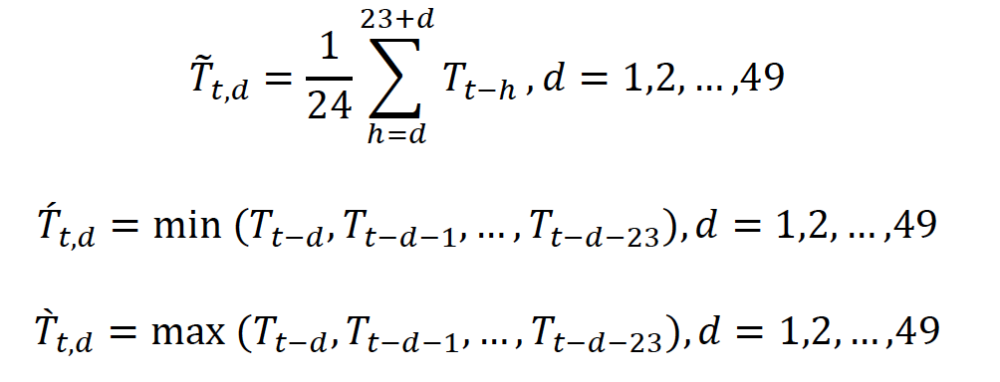
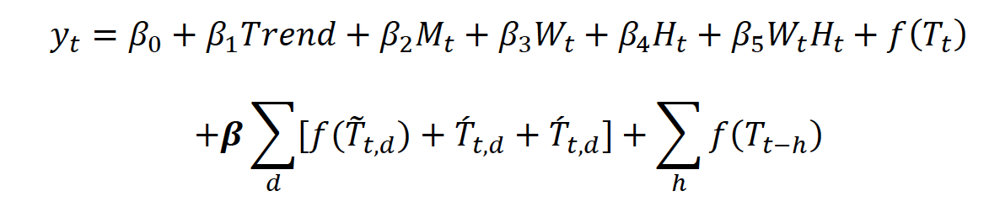

# Hourly-electric-load-forecasting
A machine learning approach to the hourly energy load forecasting problem. The project aims to forecast hourly electric loads using historical load records and temperature data. 

Feature engineering is extremely important in forecasting energy loads. Hong et al. (2015) captured the missing salient features by including the temperature variables, namely lagged hourly temperatures and 24-hour moving average temperatures. I followed their approach and varied the number of days from 0 to 7, and the number of lags from 0 to 72. In total, 795 variables were created to capture the important features. On top of that, 3 models were trained and modified to enhance the forecasting performance.

**1. The vanilla benchmark model**

To forecast the hourly load using Date and Temperature more accurately, many variables were built to expand the feature space. To build the vanilla benchmark model, 13 variables were built. As proposed by Hong et al. (2015), the model is a multiple linear regression model:

The benchmark model achieves MAPE of 8.92 in training data. The performance is not satisfying even in training dataset. So, an enhanced vanilla model is built on top of that.

**2. The enhanced vanilla benchmark model**

To include lags of temperature and other interaction terms into the model, 795 variables are built on top of the 13 basic variables.

The model follows the approach of Wang et al., 2016 and models the recency effect at an aggregated level. One thing different from their model is that 24-hour moving averages of temperature is included in the model, as well as the 24-hour moving minimum and moving maximum of temperature:

In the end, the vanilla benchmark model is extended to:

The multiple linear regression performs better than the vanilla benchmark and achieves a MAPE of 6.0 in training set. But still its performance is not very satisfying. So other machine learning models are tried to improve the forecast accuracy.

**3. The XGBoost Model**

The XGBoost achieves best performance among other ML models. I used all the 808 variables built. It achieves a MAPE of 0.66 in train (2018-2010), MAPE of 4.25 in validation (2011), significantly better than the other two models. To improve the model performance, train and validation dataset are combined to train the model.

